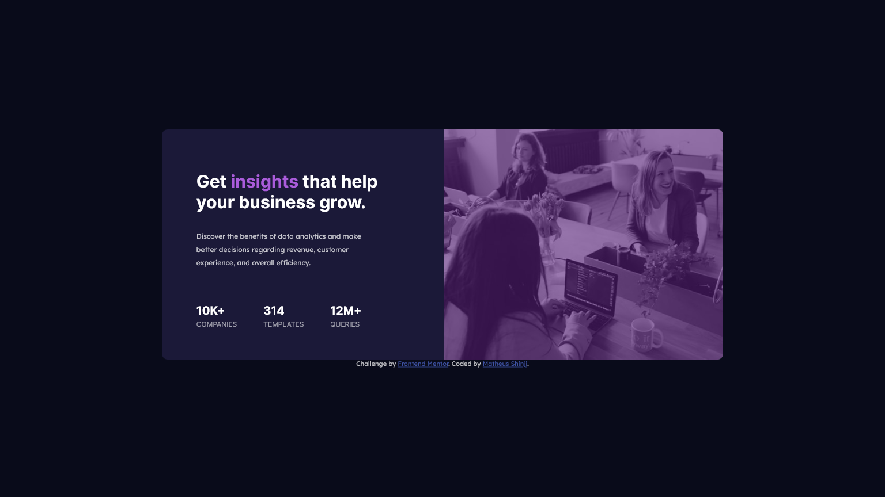

# Frontend Mentor - Stats preview card component solution

This is a solution to the [Stats preview card component challenge on Frontend Mentor](https://www.frontendmentor.io/challenges/stats-preview-card-component-8JqbgoU62). Frontend Mentor challenges help you improve your coding skills by building realistic projects. 

## Table of contents

- [Overview](#overview)
  - [The challenge](#the-challenge)
  - [Screenshot](#screenshot)
  - [Links](#links)
- [My process](#my-process)
  - [Built with](#built-with)
  - [What I learned](#what-i-learned)
  - [Continued development](#continued-development)
  - [Useful resources](#useful-resources)
- [Author](#author)

**Note: Delete this note and update the table of contents based on what sections you keep.**

## Overview

### The challenge

Users should be able to:

- View the optimal layout depending on their device's screen size

### Screenshot

### Links

- Solution URL: [https://github.com/MatheusFukuyama/CardComponent.git](https://github.com/MatheusFukuyama/CardComponent.git)
- Live Site URL: [ https://matheusfukuyama.github.io/CardComponent/]( https://matheusfukuyama.github.io/CardComponent/)

## My process

### Built with

- Semantic HTML5 markup
- CSS custom properties
- Flexbox

### What I learned

I'm still want to improve my logic and also learn to write clean code, this project still can pass through changes and refactoring while I get more knowledges.

### Useful resources

- [https://dev.to/ellen_dev/two-ways-to-achieve-an-image-colour-overlay-with-css-eio]https://dev.to/ellen_dev/two-ways-to-achieve-an-image-colour-overlay-with-css-eio) - This helped me to give a colour overlay effect in this project. But the technique that I used was diferent but you can also use this one.

## Author
- Frontend Mentor - [@MatheusFukuyama](https://www.frontendmentor.io/profile/MatheusFukuyama)

